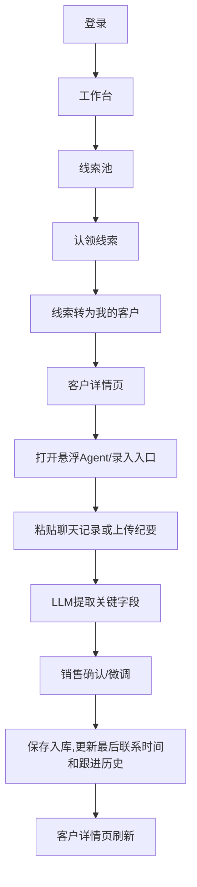
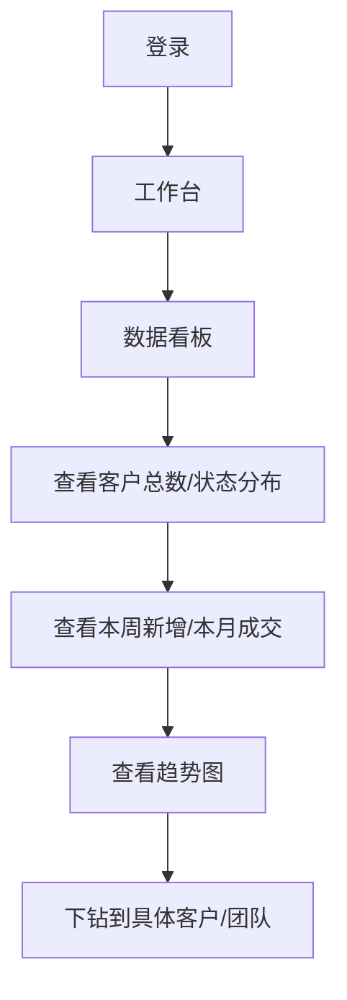
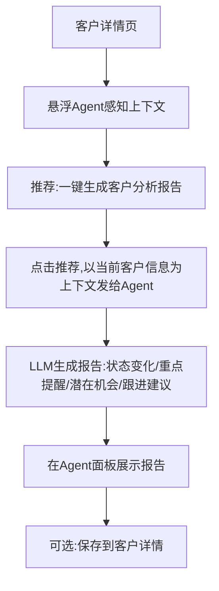
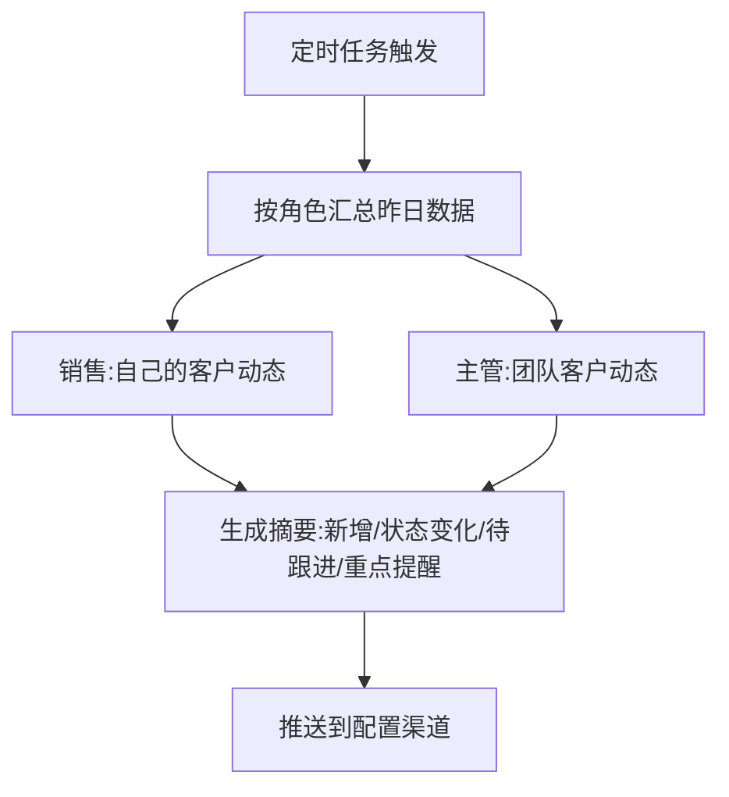

# 页面与流程

## 页面清单

| 页面 | 用户任务 | 核心信息 | 主要操作 | 入口/出口 |
| --- | --- | --- | --- | --- |
| 登录页 | 进入系统 | 账号、密码 | 登录 | / → 工作台 |
| 工作台（首页） | 快速进入各功能 | 待办、快捷入口、今日动态摘要 | 跳转线索池/我的客户/看板 | 顶栏 → 各页面 |
| 线索池 | 认领线索 | 待认领线索列表（来源、客户名、意向度、创建时间） | 认领、查看详情 | 侧栏 → 我的客户 |
| 我的客户列表 | 管理自己负责的客户 | 客户名、联系方式、跟进状态、最后联系时间、意向度 | 查看详情、新增跟进（Agent对话） | 侧栏 → 客户详情 |
| 客户详情页 | 查看客户全貌、录入跟进、生成报告 | 基础信息、沟通记录时间线、状态变化、Agent推荐 | 录入跟进、编辑信息、一键生成分析报告 | 列表 → 详情 → Agent面板 |
| 数据看板（管理者） | 掌握线索获取与转化 | 客户总数、状态分布、本周新增、本月成交、趋势图 | 切换时间范围、下钻 | 侧栏（主管可见） |
| 推送配置页 | 配置每日推送 | 推送时间、接收角色、内容项开关 | 保存配置 | 侧栏（管理员可见） |
| 用户与权限管理 | 管理团队和角色 | 用户列表、角色 | 增删改用户、分配角色 | 侧栏（管理员可见） |
| 悬浮 Agent 面板（全局） | 对话式录入、上下文任务执行 | 当前页面上下文、推荐问题、对话区 | 点击推荐、输入、执行 | 任意页面右下角悬浮 |

## 主流程

### 流程 1：线索认领 → 跟进录入（核心闭环）

### 流程 2：管理者看板

### 流程 3：客户分析报告（悬浮 Agent）

### 流程 4：每日推送

## 关键状态

### 线索/客户状态机

| 对象 | 状态 | 触发条件 | 可执行操作 |
| --- | --- | --- | --- |
| 线索 | 待认领 | 线索进入线索池 | 认领（销售） |
| 线索/客户 | 已认领 | 销售认领 | 跟进、改状态、转交[暂缓] |
| 客户 | 跟进中 | 有新跟进记录 | 继续跟进、改意向度 |
| 客户 | 已成交 | 手动标记或 Agent 识别 | 归档、复盘 |
| 客户 | 流失 | 手动标记 | 归档 |

> [待确认：状态流转是否需要更细的节点，如"初次接触/需求确认/方案报价/谈判中"？MVP 是否只保留 5 个主状态？]

### 权限矩阵

| 资源 | 管理员 | 销售主管 | 一线销售 |
| --- | --- | --- | --- |
| 线索池 | 查看/分配 | 查看团队 | 认领 |
| 我的客户 | 全部 | 团队客户 | 自己客户 |
| 客户详情 | 全部 | 团队客户 | 自己客户 |
| 录入跟进 | 全部 | 团队客户 | 自己客户 |
| 数据看板 | 全公司 | 团队 | 仅自己概览[待确认] |
| 推送配置 | 编辑 | 查看 | 仅接收 |
| 用户与权限 | 编辑 | 查看 | 不可见 |
